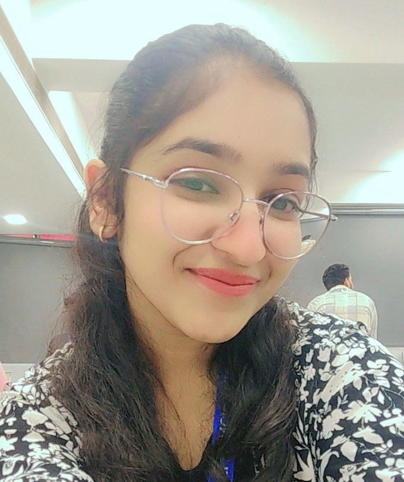

# 👩‍💻 Somya Jain

<p align="center">
  
</p>

<h3 align="center">
  CSE (AI & ML) Student | Aspiring Software Developer
</h3>

<p align="center">
  <i>Learning • Building • Exploring • Growing 🚀</i>
</p>

<p align="center">
  <a href="https://github.com/somyajain-07">
    
  </a>
  <a href="https://www.linkedin.com/in/somya-jain-70a398423/">
    
  </a>
</p>

---

## 🌟 About Me

Hi! I'm **Somya Jain**, a Computer Science and Engineering student specializing in **Artificial Intelligence and Machine Learning**.

I enjoy learning programming, exploring new technologies, and improving my problem-solving skills through hands-on projects.

Currently, I am building a strong foundation in **C++**, while exploring web development, Git/GitHub, Python, Artificial Intelligence and other areas of Computer Science.

> 💡 **My goal:** Become a skilled software developer by continuously learning, experimenting and building real-world projects.

---

## 🖥️ My Portfolio

This repository contains my personal portfolio website.

### ✨ What you'll find here

| Section      | What's inside                       |
| ------------ | ----------------------------------- |
| 👤 About     | Introduction and career interests   |
| 🛠️ Skills   | Technologies and programming skills |
| 🎓 Education | Academic journey                    |
| 💼 Portfolio | Projects and practical work         |
| 🔗 Social    | GitHub and LinkedIn profiles        |

---

## 🛠️ Tech Stack

### 🌐 Web Development

<p>
  
</p>

### 💻 Programming

<p>
  
</p>

### 🔧 Tools

<p>
  
</p>

---

<details>
<summary><b>🎯 Click to see my current skills</b></summary>

<br>

### HTML

Building the structure and content of web pages.

### CSS

Creating layouts, themes, responsive designs and interactive hover effects.

### C++

Developing programming fundamentals, logical thinking and problem-solving skills.

### Python

Exploring programming and gradually moving toward AI/ML applications.

### Git & GitHub

Learning version control and collaborative software development.

</details>

---

## 🎓 Education

### 🏫 KIET

**Bachelor of Technology in Computer Science & Engineering**

**Specialization:** Artificial Intelligence & Machine Learning

📅 **2026 — 2030**

Currently building a strong foundation in programming, computational thinking and core Computer Science concepts.

---

### 📚 Shirdi Sai Public School

**Senior Secondary Education — Class XI & XII**

📅 **2022 — 2026**

Studied **Physics, Chemistry and Mathematics**, developing a strong foundation in logical reasoning and problem solving.

---

## 🚀 Currently Learning

```text
C++
 ↓
Programming Fundamentals
 ↓
Data Structures & Algorithms
 ↓
Web Development
 ↓
Python
 ↓
Artificial Intelligence
 ↓
Machine Learning
```

> 🌱 One step at a time.

---

## 💼 Projects

### 🌐 Personal Portfolio

A personal portfolio website created to showcase my:

* Skills
* Education
* Projects
* Learning journey
* Social profiles

**Technologies:** HTML + CSS

---

### 🤖 More Projects Coming Soon...

I'm continuously working on new projects as I learn more about:

* Artificial Intelligence
* Machine Learning
* Web Development
* C++
* Python
* Problem Solving

---

## 📂 Repository Structure

```text
Portfolio/
│
├── 📄 index.html
├── 🎨 style.css
├── 🖼️ profile.jpeg
└── 📖 README.md
```

---

<details>
<summary><b>⚙️ How to Run This Project</b></summary>

<br>

### 1️⃣ Clone the repository

```bash
git clone https://github.com/somyajain-07/your-repository-name.git
```

### 2️⃣ Open the project

```bash
cd your-repository-name
```

### 3️⃣ Run the website

Open:

```text
index.html
```

in your browser.

### 💡 Recommended

If you're using **VS Code**, install the **Live Server** extension and open the project using:

```text
Right Click → Open with Live Server
```

</details>

---

## 🎨 Design

The portfolio follows a **modern dark-themed design** with a gold accent.

```text
┌──────────────────────────────────────────────┐
│                                              │
│              👩‍💻 SOMYA JAIN                 │
│       CSE (AI & ML) Student                  │
│                                              │
├──────────────────┬───────────────────────────┤
│                  │                           │
│   PROFILE        │        ABOUT              │
│                  │                           │
│   📧 Email       │        SKILLS             │
│                  │                           │
│   📱 Phone       │        EDUCATION          │
│                  │                           │
│   📍 Location    │        PORTFOLIO          │
│                  │                           │
└──────────────────┴───────────────────────────┘
```

The website uses:

* 🌑 Dark background
* 🟡 Gold highlights
* 🃏 Interactive skill cards
* 🎓 Education timeline
* 🔗 Social media links
* ✨ Hover animations

---

## ✨ Interactive Features

### 🖱️ Skill Cards

Hover over a skill card to see the interactive scaling and gold highlight effect.

### 🧭 Navigation

Navigate between:

```text
About → Skills → Education → Portfolio
```

### 🎓 Education Timeline

The education section uses a visual timeline with highlighted markers.

### 🔗 Social Profiles

Direct links are provided for GitHub and LinkedIn.

---

## 🔮 Future Goals

* [ ] 📱 Improve mobile responsiveness
* [ ] 🌗 Add Light/Dark mode
* [ ] ✨ Add smooth scrolling
* [ ] 🎞️ Add page animations
* [ ] 💼 Add project showcase cards
* [ ] 📊 Add interactive skill levels
* [ ] 📬 Add contact form
* [ ] 📄 Add downloadable resume
* [ ] 🤖 Add AI-powered portfolio chatbot
* [ ] 🚀 Deploy portfolio
* [ ] 🧩 Add JavaScript interactions

---

## 📊 GitHub Stats

<p align="center">


</p>

---

## 🐍 Contribution Activity

<p align="center">
  
</p>

---

## 🤝 Let's Connect

<p align="center">

<a href="https://github.com/somyajain-07">
  
</a>

<a href="https://www.linkedin.com/in/somya-jain-70a398423/">
  
</a>

</p>

---

<p align="center">

### 💻 Built with curiosity, creativity & code.

⭐ **If you like my work, consider giving this repository a star!**

<br>

**© 2026 Somya Jain**

</p>
